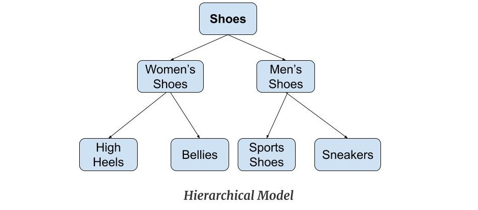
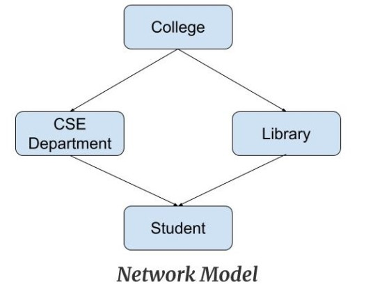

# DBMS

#### Data
* Data is distinct pieces of information, usually formatted in a special way.

#### Information
* Processed data or usable data is called information.

#### DataBase
* Collection of similar or related data is called database.

#### DataBase Management system
* collection of data & set of programs to access & store in easier & efficient way.
* software to manage database.
* organized collection of structured information, data
* stored electronically in computer system

#### limitation of file oriented system
* redundent data: (repetation of data)
* data inconsistency: (diff data in different files)
* diffuculty in accesing the data: (no easy to access data)
* limited data sharing: (diff file extension in diff os, so hard to share)
* integrity: (hard to  follow rules [acc balance > 500])
* atomicity problem: (either all operation will or complete or no operation will [100 or 0])
* security problem: (diff to achive security)

#### advantages of dbms
* no redundancy: (no repetaition of data bcz everything stored in single db)
* authorised users: (authorized [users/multiple users] of org can share data)
* backup: (it provides recovery facility, automatic backup from hardware & software)
* faster data access: (can access data easily & fast)
* consistency: (it is in consistent bcz of no redundency)

#### disadvantages of dbms
* cost of hardware: (requires high speed processor, more memory)
* complexity: (creates additional complexity & requirement [backup file, etc...])
* high impact of failure: (all stored in single db, if it get damaged all gonna lost)

#### architecture of dbms (3 level of dbms architecture)
* external (view level)
* conceptual (logical level)
* internal (physical level)

    exernal level 
    * different user can view their desired data from db with help of other 2 level
    * kisko kitna data dikhane ka h uski okaat k hisab se or kitna abstract krkr rakhna h 
    * no need to know db
    * need to know design schema, table defination, data structure, etc...

    conceptual level 
    * realtion among data, schema decided here
    * maintained by db administrator

    internal level 
    * here actual data stored
    * responsible for data allocation
    * lowest level of architecture

### data model
* gives idea that how final system will look like after complete implementation
* used to show how data is stored, connected, accessed, updated in dbms

### types of data model
* hierarchical model 
* network model
* relational model
* entity-relationship model 
* etc... (object oriented model, object-relational model, flat data model)

### hierarchical model
* first dbms model
* organises data in hierarchical tree structure
* easily represents real-world relationships

* features 
	- one to many relationship: (one path from parent to any node, bcz organized in tree-like-structure)
	- parent-child relationship: (each child has 1 parent but parent node can have more than 1 child)
	- deletion problem: (if parent got deleted then child will automatically)
	- pointers: (used to link node, to navigate between stored data)
* advantages 
	- fast traverse
	- changes in parents automatically reflected in child so integrity is maintained
* diadvantages
	- complex relationships are not supported
	- multiple parents not allowed
	- if parent deleted child automatically deleted

### network model
* extension of hierarchical model
* most popular model before relation model
* same as hierarchical but with multiple parents

* features
	- ability to merge more relationship
	- many paths
	- circular linked list
* advantages 
	- fast data access as compare to hierarchical mode bca more than 1 path available to reach
	- integrity presents bca changes in parent reflects in child
* disadvantages
	- relationship management is complex
	- insertion, updation, deletion also complex

### relational model
* most widly used model
* data maintained in 2 dimensional table
* all data stored in form of row & columns

