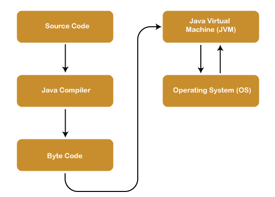
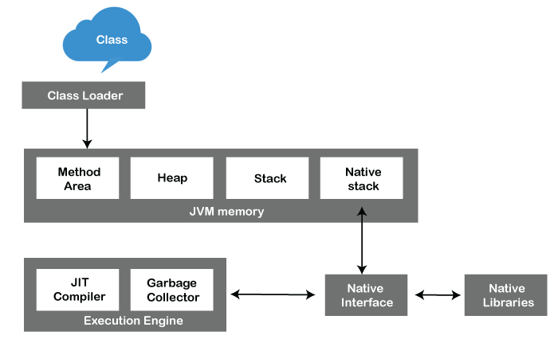
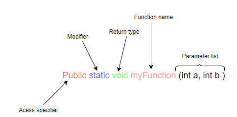

# Java Important Exam notes - Topic to Topic

## What is Java

One major advantage of developing software with Java is its portability. Once you have written code for a Java program on a notebook computer, it is very easy to move the code to a mobile device. When the language was invented in 1991 by James Gosling of Sun Microsystems (later acquired by Oracle), It is a general-purpose programming language intended to let programmers write once, run anywhere (WORA), meaning that compiled Java code can run on all platforms that support Java without the need to recompile. Java applications are typically compiled to bytecode that can run on any Java virtual machine (JVM) regardless of the underlying computer architecture. 

The syntax of Java is similar to C and C++, but has fewer low-level facilities than either of them. The Java runtime provides dynamic capabilities (such as reflection and runtime code modification) that are typically not available in traditional compiled languages. As of 2019, Java was one of the most popular programming languages in use according to GitHub, particularly for client–server web applications, with a reported 9 million developers.

One more reason of java popularity is **Java Applet**
Applet is a special type of program that is embedded in the webpage to generate the dynamic content. It runs inside the browser and works at client side.
Java applets were small applications written in the Java programming language, or another programming language that compiles to Java bytecode, and delivered to users in the form of Java bytecode. The user launched the Java applet from a web page, and the applet was then executed within a Java virtual machine (JVM) in a process separate from the web browser itself. A Java applet could appear in a frame of the web page, a new application window, Sun's AppletViewer, or a stand-alone tool for testing applets. 

## History of Java
The syntax of Java is similar to C and C++, but has fewer low-level facilities than either of them. The Java runtime provides dynamic capabilities (such as reflection and runtime code modification) that are typically not available in traditional compiled languages. As of 2019, Java was one of the most popular programming languages in use according to GitHub,[19][20] particularly for client–server web applications, with a reported 9 million developers.

Sun Microsystems released the first public implementation as Java 1.0 in 1996.[27] It promised write once, run anywhere (WORA) functionality, providing no-cost run-times on popular platforms. Fairly secure and featuring configurable security, it allowed network- and file-access restrictions. Major web browsers soon incorporated the ability to run Java applets within web pages, and Java quickly became popular.


## Java Architecture

Java Architecture is a collection of components, i.e., JVM, JRE, and JDK. It integrates the process of interpretation and compilation. It defines all the processes involved in creating a Java program. Java Architecture explains each and every step of how a program is compiled and executed.

#### Java Architecture can be explained by using the following steps:

- There is a process of compilation and interpretation in Java.
- Java compiler converts the Java code into byte code.
- After that, the JVM converts the byte code into machine code.
- The machine code is then executed by the machine.



#### Components of Java Architecture
The Java architecture includes the three main components:

    Java Virtual Machine (JVM)
    Java Runtime Environment (JRE)
    Java Development Kit (JDK)

##### 1. Java Virtual Machine >>

The main feature of Java is WORA. WORA stands for Write Once Run Anywhere. The feature states that we can write our code once and use it anywhere or on any operating system. Our Java program can run any of the platforms only because of the Java Virtual Machine. It is a Java platform component that gives us an environment to execute java programs. JVM's main task is to convert byte code into machine code.

JVM, first of all, loads the code into memory and verifies it. After that, it executes the code and provides a runtime environment. Java Virtual Machine (JVM) has its own architecture, which is given below:

##### JVM Architecture

JVM is an abstract machine that provides the environment in which Java bytecode is executed. The falling figure represents the architecture of the JVM.



**ClassLoader:** ClassLoader is a subsystem used to load class files. ClassLoader first loads the Java code whenever we run it.

**Class Method Area:** In the memory, there is an area where the class data is stored during the code's execution. Class method area holds the information of static variables, static methods, static blocks, and instance methods.

**Heap:** The heap area is a part of the JVM memory and is created when the JVM starts up. Its size cannot be static because it increase or decrease during the application runs.

**Stack:** It is also referred to as thread stack. It is created for a single execution thread. The thread uses this area to store the elements like the partial result, local variable, data used for calling method and returns etc.

**Native Stack:** It contains the information of all the native methods used in our application.

**Execution Engine:** It is the central part of the JVM. Its main task is to execute the byte code and execute the Java classes. The execution engine has three main components used for executing Java classes.

- **Interpreter:** It converts the byte code into native code and executes. It sequentially executes the code. The interpreter interprets continuously and even the same method multiple times. This reduces the performance of the system, and to solve this, the JIT compiler is introduced.
- **JIT Compiler:** JIT compiler is introduced to remove the drawback of the interpreter. It increases the speed of execution and improves performance.
- **Garbage Collector:** The Java platform
allows you to create as many objects as you want, and you don't have to worry
about destroying them. The Java runtime environment deletes objects when it
determines that they are no longer being used. This process is called garbage
collection.An object is eligible for garbage collection when there are no more references
to that object. References that are held in a variable are usually dropped when
the variable goes out of scope. Remember that a program can have multiple
references to the same object; all references to an object must be dropped
before the object is eligible for garbage collection.
The Java runtime environment has a garbage collector that periodically frees
the memory used by objects that are no longer referenced. The garbage
collector does its job automatically when it determines that the time is right.

**Java Native Interface:** Java Native Interface works as a mediator between Java method calls and native libraries.


##### 2. Java Runtime Environment >>
It provides an environment in which Java programs are executed. JRE takes our Java code, integrates it with the required libraries, and then starts the JVM to execute it. To learn more about the Java Runtime Environment.

##### 3. Java Development Kit >>
It is a software development environment used in the development of Java applications and applets. Java Development Kit holds JRE, a compiler, an interpreter or loader, and several development tools in it. To learn more about the Java Development Kit, click here.


## Java is Robust
Robustness is the capacity of a computer system to handle the errors during execution and manage the incorrect input of data. Java is robust because it utilizes strong memory management. There is an absence of pointers that bypasses security dilemmas.

There is automatic garbage collection in Java which runs on the Java Virtual Machine to eliminate objects which are not being accepted by a Java application anymore. There are type-checking mechanisms and exception-handling in Java. All these features make Java robust.

## Define Class

The Object-Oriented Programming approach considers data as the most critical element. A class helps in binding the related data and functions together. It also restricts access to sensitive data and functions it contains.

classes form the backbone of all Java programs. The class is at the core of Java. It is the logical construct upon which the entire Java language is built because it defines the shape and nature of an object. As such, the class forms the basis for object- oriented programming in Java. Any concept you wish to implement in a Java program must be encapsulated within a class When you define a class, you declare its exact form and nature. You do this by specifying the data that it contains and the code that operates on that data. While very simple classes may contain only code or only data, most real- world classes contain both. In Java, everything you write (except import and package statements) will reside inside a class. A class provides a pattern that you can use to create one or more objects.

### Define Constructors
A constructor in Java is a special method that is used to initialize objects. The constructor is called when an object of a class is created. It can be used to set initial values for object attributes:


## Define Object 

Objects are nothing but instances of a class. 

When you write a class, you create a template for your new data type. The system allocates memory for your data type only when you create at least an object of your class.

Objects are key to understanding object-oriented technology. Look around right now and you'll find many examples of real-world objects: your dog, your desk, your television set, your bicycle.

Real-world objects share two characteristics: They all have state and behavior. Dogs have state (name, color, breed, hungry) and behavior (barking, fetching, wagging tail). Bicycles also have state (current gear, current pedal cadence, current speed) and behavior (changing gear, changing pedal cadence, applying brakes). Identifying the state and behavior for real-world objects is a great way to begin thinking in terms of object-oriented programming.

##### 1) Referencing an Object's Fields
Object fields are accessed by their name. You must use a name that is unambiguous. You may use a simple name for a field within its own class. For example, we can add a statement within the Rect class that prints the length and breadth:
```
System.out.println("Length and breadth are: "+ length + ", " + breadth);
```
In this case, length and breadth are simple names. Code that is outside the object's class must use an object reference or expression, followed by the dot (.) operator, followed by a simple field name, as in:
```
objectReference.fieldName
```
For example, the code in the Rect class, we can refer to the length
and breadth fields within the Rect object named rectOne, the class
must use the names rectOne.length and rectOne.breadth,
respectively. The program uses two of these names to display the
length and the breadth of rectOne:
```
System.out.println("Lenght of rectOne: " + rectOne.length);
System.out.println("Breadth of rectOne: " + rectOne.breadth);
```
##### 2) Calling an Object's Methods
You also use an object reference to invoke an object's method. You append the method's name to the object reference, with an dot operator (.). Also, you provide, within enclosing parentheses, any arguments to the method. If the method does not require any arguments, use empty parentheses. 
```
objectReference.methodName(argumentList);
or objectReference.methodName();
```
The Rect class has a method: area() to compute the rectangle's area. Here's the code that invokes this method:
```
System.out.println("Area of rectOne: " + rectOne.area());
```
Some methods, such as area(), return a value. For methods that return a
value, you can use the method invocation in expressions. You can assign the
return value to a variable, use it to make decisions, or control a loop. This code
assigns the value returned by area() to the variable areaOfRectangle:
```
int areaOfRectangle = rectOne.area();
```


## Define Functions/Methods

The goal of every programmer is to save time in both programming and debugging. However, there comes a time when you write hundreds of lines of code. It’s very frustrating having to repeat the same code now and then. It is more frustrating when your code gets some error, and you will need to debug the whole program.

Improve your programming expertise by using functions. Functions help in avoiding ambiguity. You will agree that breaking down the code into smaller chunks in functions will help you organize your work, and debugging becomes easy. Why repeat the same lines of code several places where you can put it inside a function and call it whenever you need to perform that task. Code reusability saves a lot of time.

Example:
```
public class Main {
    public static void myFuntion() {
        // Do something here
    }
}
```



```
Public static void myFuction(String name, int age )
{
// fuction code
}
```


- Access specifier – this shows the scope of availability of a fuction. ‘Public’ means that the function can be called from aywhere in the program. We have other access specifiers such as private and protected.Protected, the method can only be called within the class and its subslcasses. Private can oly be called inside the class
- Modifier – ‘static’ is optional in a fuction defination. In this case static means  the function is a not an object of the main class but a method that belongs to the main class.
- Retur type – We have functions that return a value and functions that do not return anything. Void, means that the function does not have a return value. If the fuction was to return a value, replace void with the data type of the returned value.
- Function name – This the name of the function
- Parameter list – it informs the compiler about the data type it will receive and the value to be returned.


## Data Types in Java
#### Primitive vs non-primitive data structure

Data structure means organizing the data in the memory. The data can be organized in two ways either linear or non-linear way.

There are two types of data structure available for the programming purpose:

- Primitive data structure
- Non-primitive data structure

Primitive data structure is a fundamental type of data structure that stores the data of only one type whereas the non-primitive data structure is a type of data structure which is a user-defined that stores the data of different types in a single entity.


##### Primitive data structure

Primitive data structure is a data structure that can hold a single value in a specific location whereas the non-linear data structure can hold multiple values either in a contiguous location or random locations

The examples of primitive data structure are float, character, integer and pointer. The value to the primitive data structure is provided by the programmer. The following are the four primitive data structures:

- **Integer:** The integer data type contains the numeric values. It contains the whole numbers that can be either negative or positive. When the range of integer data type is not large enough then in that case, we can use long.
- **Float:** The float is a data type that can hold decimal values. When the precision of decimal value increases then the Double data type is used.
- **Boolean:** It is a data type that can hold either a True or a False value. It is mainly used for checking the condition.
- **Character:** It is a data type that can hold a single character value both uppercase and lowercase such as 'A' or 'a'.

##### Non-primitive data structure

The non-primitive data structure is a kind of data structure that can hold multiple values either in a contiguous or random location. The non-primitive data types are defined by the programmer. The non-primitive data structure is further classified into two categories, i.e., linear and non-linear data structure.

In case of linear data structure, the data is stored in a sequence, i.e., one data after another data. When we access the data from the linear data structure, we just need to start from one place and will find other data in a sequence.

The following are the types of linear data structure:

- **Array:** An array is a data structure that can hold the elements of same type. It cannot contain the elements of different types like integer with character. The commonly used operation in an array is insertion, deletion, traversing, searching.
