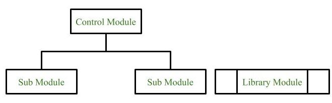
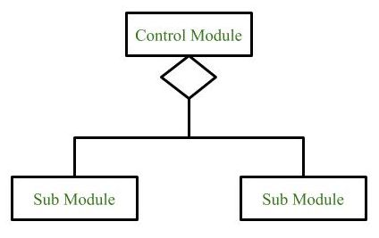
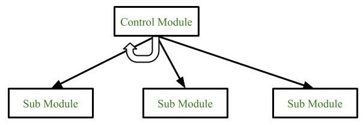
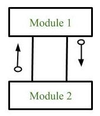
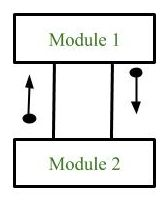
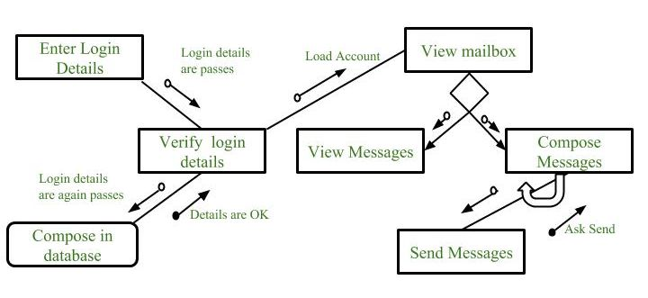
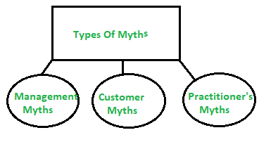
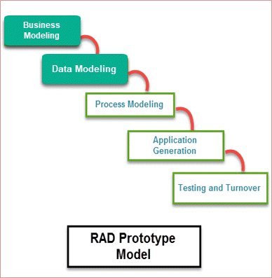
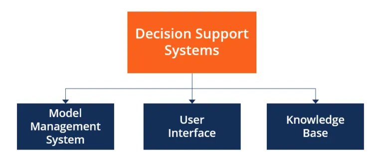

# Software Engineering
# UNIT 1
## What is system -
System is a group of elements or components which work together to accomplish a common goal.

### System Analysis
* In very simple words, system analysis & design is a study in which we learn how to analyze an existing system & create a better one.
* System Analysis is a process of a studying & observing a system to know how its works and to identify its goals & purposes.

### System Design 
* It is a process f* plannign a new system or replacing an existing system.
* It is done by defining its components or moduler to satisfy the specific requirements.

### Elements of a System:
1. Components : An irreducible part or aggregation of parts that makes up a system; also
called a subsystem.
2. Interrelated components : Dependence of one part of the system on one or more other
system parts.
3. Boundary : The line that marks the inside and outside of a system and that sets off the
system from its environment.
4. Purpose : The overall goal or function of a system.
5. Environment : Everything external to a system that interacts with the system.
6. Interfaces : Point of contact where a system meets its environment or where subsystems
meet each other.
7. Constraints : A limit to what a system can accomplish.
8. Input : Inputs are the information that enters into the system for processing.
9. Output : The main objective of a system is to get an output which is helpful for its
user. Output is the final outcome of processing.

### Characteristics and types of system
* Organization
  * structure and order
  * Example: Hierarchical organization in a company.
  * Computer system: organization of various components like input devices, output
devices, CPU and storage devices
* Interaction
  * Between sub systems or the components
  * Example: the main memory holds the data that has to be operated by the ALU.
* Interdependence
  * Component linkage
  * Component dependence
* Integration
  * How subsystems are tied together to achieve the system objective
* Central Objective
  * Should be known in early phases of analysis
### Types of Systems
  * Physical or Abstract System
  * Physical system: tangible entities
  * static or dynamic in nature.
  * Example : system-computer centre
  * Desks and chairs are the static parts
  * Programs, data, and applications can change according to the user's needs.
  * Abstract systems are conceptual. These are not physical entities. They may be
formulas, representation or model of a real system.

## System Development Life Cycle:
An effective System Development Life Cycle (SDLC) should result in a high quality system that meets customer expectations, reaches completion within time and cost evaluations, and works effectively and efficiently in the current and planned Information Technology infrastructure.
System Development Life Cycle (SDLC) is a conceptual model which includes policies and procedures for developing or altering systems throughout their life cycles.
The system development life cycle (SDLC) is a seven-phase process that helps systems engineers and developers plan, create, test and launch information systems. Effective planning and implementation of this process can help you develop high-quality information systems that are timely and within your budget. 

### The 7 phases of system development −
##### 1. Planning
Planning helps systems engineers and developers identify whether a new system can help a business achieve its strategic objectives. A preliminary plan is sometimes called a feasibility study, and can allow development teams to outline the resources they need to build new infrastructure or upgrade an existing service. This phase of the life cycle helps teams discover potential problems and work toward solutions.
##### 2. Analysis
In the analysis phase, development teams work on the source of the issue or the reason for the desired change. They can take the ideas they came up with during the planning phase and identify the functional requirements of their proposed project or solution to find the best way to achieve their goals. 

Phase tw* is als* where you can perform a system analysis and review end-users' needs to make sure the proposed system meets expectations. The analysis phase is important for assigning team members to individual pieces of the project, assessing the business's needs and establishing project timelines.

##### 3. Systems design
The third phase of the system development life cycle requires a detailed description of desired features and operations. This could include screen layouts, business rules and process diagrams. By describing the steps in the proposed algorithm or system in plain language, end-users can discuss their specific needs for the proposed system. Consider creating a master document that specifies the plan and requirements.

For example, a development team might use a flowchart to represent their algorithm and communicate to a client or business important project elements like modules, architecture, components' interfaces and data. The client or business can then clarify aspects of the proposed project or revise their requirements.

##### 4. Development
After thorough planning, analysis and review, systems engineers and developers are ready to work on the project's implementation. Because all the stakeholders worked together to define the steps, timelines and expectations clearly, production should be able to progress with limited issues. If you're working with outside development teams, it's important to make sure the developers and programmers fully understand the project specifications and system design. You can share the master document you created to make sure everyone learns the development plan.

Using the previous chat feature example, your development team would begin the coding process or installation of a widget depending on the decisions the team made in the previous phases.

##### 5. Systems testing and integration
The next phase tests the programs and procedures you implemented. Usually, a quality assurance (QA) professional completes this part of the process by verifying the proposed design meets the predetermined requirements. You might have to test the new system multiple times to find errors, check for bugs and ensure interoperability. Repeat this phase until you resolve all errors and meet the end-user's specifications. Completing the verification and validation processes helps ensure the program's success.

For example, you could test the chat feature to make sure the responses, timing and visual display meet client requirements and seamlessly integrate into the current site without affecting the functionality of the existing features.

##### 6. Implementation
The sixth phase is implementation. This is where you make the software or program accessible for the end-user. Depending on the project requirements, you might als* use this time to perform a direct cutover, where you move the data and components from the old system to the new system.

Consider performing your cutover when no one is using the system and warning users they might experience a loss of functionality while you complete the process. When you've finished, you should be able to use the new program or service. For example, the chat feature would now be live and able to receive and send messages to system users.

##### 7. Operation and maintenance
Once the new program or system is functioning, it's important to continue monitoring for potential bugs, errors and any updates requested by end-users. Consider reviewing the effectiveness of the system development life cycle in this phase. Identify steps where processes ran smoothly and parts of the process you could improve next time. When you're ready to start your next project, begin again at phase one.

If you installed a chat feature, you might use this time to assess its final functionality compared to the original request. If parts of the process took longer than you would have liked or if you receive feedback from the client, you can take what you learned and apply it to future projects.

## feasibility Study or in simple words Planning 

* Feasibility study is an analysis that takes all of a projects relevant factors into account including economic, technical, legal adn scheduling considereations to ascertain the likehood of completing the project successfull
* Project manager use feasibility studies to know the pros and cons of undertaking a project before they invest a lot of money and time in it.
* It als* provides a companies management with crucial information that could prevent the company from entering blindly into risky business.

### Meaning of feasibility analysis

* Refers to the process of examining the viability of a business idea.
* A prospective enterpeneur having creative and inovative idea must conduct feasibility analysis.

### Need for feasibility analysis 
* Help in providing guidlines for preparing business plan.
* Shortcoming/Gaps if any can be detected and measures can be taken to resolve them.
* Helps in understanding the vability of the concept or business idea.
* It boosts up the confidence level of an enterpeneur with respect to the business idea.
* It reduces the chances of business failure.
* Apprises enterpeneur about the risk involved.

## Information Gathering Tools
Assessment is about gathering the necessary information about wh* you are as a literacy agency, your current strengths, weakness, opportunities and threats. Remember, at this point, you are simply gathering information on the current internal and external environment facing your literacy agency; you are not making any judgments or drawing any conclusions about what the information means for the future. There are many different methods of information gathering that people have used to good advantage and here are a few:
1. Questionnaires, surveys and checklists
   * Used when you want to collect a lot of information from people in a non-threatening way.
2. Personal interviews
   * Used when you want to fully understand a person’s opinions or point of view or to get additional information to a questionnaire.
3. Documentation review
   * Used when you want to gather information on current practices without interrupting the program by examining program monitoring reports, program statistics, learner  progress reports, annual reports, performance appraisals, board evaluations, written policies and procedures, memos, minutes, financial records, etc. 
4. Observation
   * Used to watch the program in operation to gather information about what actually happens day-to-day.
5. Focus group
   * Used to explore a topic in depth with key stakeholders to learn what the common understanding is on various issues.
6. Case Studies
   * Used to depict experiences, processes or practices with a view to developing understanding through examination and cross comparisons.

## Software Analysis & Design Tools:
### Data Flow Diagram

Data flow diagram is graphical representation of flow of data in an information system. It is capable of depicting incoming data flow, outgoing data flow and stored data. The DFD does not mention anything about how data flows through the system. There is a prominent difference between DFD and Flowchart. The flowchart depicts flow of control in program modules. DFDs depict flow of data in the system at various levels. DFD does not contain any control or branch elements.

#### Types of DFD
Data Flow Diagrams are either Logical or Physical.
* Logical DFD - This type of DFD concentrates on the system process, and flow of data in the system.For example in a Banking software system, how data is moved between different entities. 
* Physical DFD - This type of DFD shows how the data flow is actually implemented in the system. It is more specific and close to the implementation.

### Structure Charts 

Structure chart is a chart derived from Data Flow Diagram. It represents the system in more detail than DFD. It breaks down the entire system into lowest functional modules, describes functions and sub-functions of each module of the system to a greater detail than DFD. Structure chart represents hierarchical structure of modules. At each layer a specific task is performed. 
Here are the symbols used in construction of structure charts -

#### 1. Module
It represents the process or task of the system. It is of three types.

* Control Module
* A control module branches to more than one sub module.
* Sub Module
* Sub Module is a module which is the part (Child) of another module.
* Library Module
* Library Module are reusable and invokable from any module.

 

#### 2. Conditional Call 
It represents that control module can select any of the sub module on the basis of some condition.

#### 3. Loop (Repetitive call of module)
It represents the repetitive execution of module by the sub module.
A curved arrow represents loop in the module.
All the sub modules cover by the loop repeat execution of module.

#### 4. Data Flow
It represents the flow of data between the modules. It is represented by directed arrow with empty circle at the end.

#### 5. Control Flow
It represents the flow of control between the modules. It is represented by directed arrow with filled circle at the end.

#### 6. Physical Storage 
Physical Storage is that where all the information are to be stored.

#### Example : Structure chart for an Email server

## Process Design 
* The main aim of design engineering is to generate a model which shows firmness, delight and commodity.
* Software design is an iterative process through which requirements are translated into the blueprint for building the software.

## Software quality guidelines
#### What Is Code Quality?

The quality of your code is important, as it impacts your overall software quality. If the quality of your code is bad, most likely your software quality will als* be bad.

* A design is generated using the recognizable architectural styles and compose a good design characteristic of components and it is implemented in evolutionary manner for testing.
* A design of the software must be modular i.e the software must be logically partitioned into elements.
* In design, the representation of data , architecture, interface and components should be distinct.
* A design must carry appropriate data structure and recognizable data patterns.
* Design components must show the independent functional characteristic.
* A design creates an interface that reduce the complexity of connections between the components.
* A design must be derived using the repeatable method.
* The notations should be use in design which can effectively communicates its meaning.

### Quality attributes
#### The attributes of design name as 'FURPS' are as follows:

###### Functionality:
It evaluates the feature set and capabilities of the program.
###### Usability:
It is accessed by considering the factors such as human factor, overall aesthetics, consistency and documentation.
###### Reliability:
It is evaluated by measuring parameters like frequency and security of failure, output result accuracy, the mean-time-to-failure(MTTF), recovery from failure and the the rogram predictability.
###### Performance:
It is measured by considering processing speed, response time, resource consumption, throughput and efficiency.
###### Supportability:
* It combines the ability to extend the program, adaptability, serviceability. These three term defines the maintainability.
* Testability, compatibility and configurability are the terms using which a system can be easily installed and found the problem easily.
* Supportability als* consists of more attributes such as compatibility, extensibility, fault tolerance, modularity, reusability, robustness, security, portability, scalability.

## Software design concepts

Software design is a process to transform user requirements into some suitable form, which helps the programmer in software coding and implementation.

For assessing user requirements, an SRS (Software Requirement Specification) document is created whereas for coding and implementation, there is a need of more specific and detailed requirements in software terms. The output of this process can directly be used into implementation in programming languages.

Software design is the first step in SDLC (Software Design Life Cycle), which moves the concentration from problem domain to solution domain. It tries to specify how to fulfill the requirements mentioned in SRS.

##### 1. Abstraction
Abstraction refers to a powerful design tool, which allows software designers to consider components at an abstract level, while neglecting the implementation details of the components. Abstraction is the process or result of generalization by reducing the information content of a concept or an observable phenomenon.

##### 2. Architecture
Software architecture refers to the structure of the system, which is composed of various components of a program/ system, the attributes (properties) of those components and the relationship amongst them. The software architecture enables the software engineers to analyze the software design efficiently. In addition, it als* helps them in decision-making and handling risks.

##### 3. Patterns
A pattern provides a description of the solution to a recurring design problem of some specific domain in such a way that the solution can be used again and again. The objective of each pattern is to provide an insight to a designer wh* can determine the following.

* Whether the pattern can be reused
* Whether the pattern is applicable to the current project
* Whether the pattern can be used to develop a similar but functionally or structurally different design pattern.

##### 4. Modularity
Modularity is achieved by dividing the software into uniquely named and addressable components, which are als* known as modules. A complex system (large program) is partitioned into a set of discrete modules in such a way that each module can be developed independent of other modules. After developing the modules, they are integrated together to meet the software requirements.

##### 5. Information hiding
Modules should be specified and designed in such a way that the data structures and processing details of one module are not accessible to other modules. They pass only that much information to each other, which is required to accomplish the software functions. The way of hiding unnecessary details is referred to as information hiding.

##### 6. Functional independence
  * The functional independence is the concept of separation and related to the concept of modularity, abstraction and information hiding.
  * The functional independence is accessed using tw* criteria i.e Cohesion and coupling.
  
###### Coupling and Cohesion
Cohesion is a measure that defines the degree of intra-dependability within elements of a module. The greater the cohesion, the better is the program design.

Coupling is a measure that defines the level of inter-dependability among modules of a program. It tells at what level the modules interfere and interact with each other. The lower the coupling, the better the program.

##### 7. Refinement
Refinement is a top-down design strategy used for decomposing a system from a high level of abstraction into a more detailed level (lower level) of abstraction. At the highest level of abstraction, function or information is defined conceptually without providing any information about the internal workings of the function or internal structure of the data. As we proceed towards the lower levels of abstraction, more and more details are available.

##### 8. Refactoring
Refactoring is an important design activity that reduces the complexity of module design keeping its behaviour or function unchanged. Refactoring can be defined as a process of modifying a software system to improve the internal structure of design without changing its external behavior. During the refactoring process, the existing design is checked for any type of flaws like redundancy, poorly constructed algorithms and data structures, etc., in order to improve the design. 

##### 9. Design classes
The model of software is defined as a set of design classes. Every class describes the elements of problem domain and that focus on features of the problem
which are user visible.

# UNIT 2
## Software 
Compouter Program or a instruction that provide desired function or features when executed.

### Engineering 
The process of using knowledge & principles to design, build & analyze objects.

### Software Engineering 
The process of developing maintaining  a software in a systematic, disciplined & quantitible manner.

##### How an engineer solves a problem -
* Understand the problem.
* Plan the solution.
* Implement the plan.
* Examine the result.

### Dual Role of Software:
1. As a product –
   * It delivers the computing potential across network of Hardware.
   * It enables the Hardware to deliver the expected functionality.
   * It acts as information transformer because it produces, manages, acquires, modifies, displays, or transmits information.
2. As a vehicle for delivering a product 
   * It provides system functionality (e.g., payroll system)
   * It controls other software (e.g., an operating system)
   * It helps build other software (e.g., software tools)

### Software Myths:
Most, experienced experts have seen myths or superstitions (false beliefs or interpretations) or misleading attitudes (naked users) which creates major problems for management and technical people. The types of software-related myths are listed below.

#### (i) Management Myths:
Myth 1:
  - We have all the standards and procedures available for software development.

Fact:
  - Software experts d* not know all the requirements for the software development.
  - And all existing processes are incomplete as new software development is based on new and different problem.

Myth 2:
  - With the addition of more people and program planners to Software development can help meet project deadlines (If lagging behind).

Fact: 
  - If software is late, adding more people will merely make the problem worse. This is because the people already working on the project now need to spend time educating the newcomers, and are thus taken away from their work. The newcomers are als* far less productive than the existing software engineers, and s* the work put into training them to work on the software does not immediately meet with an appropriate reduction in work.

#### (ii)Customer Myths: 

The customer can be the direct users of the software, the technical team, marketing / sales department, or other company. Customer has myths leading to false expectations (customer) & that’s why you create dissatisfaction with the developer.

Myth 1
  - A general statement of intent is enough to start writing plans (software development) and details of objectives can be done over time.

Fact:
  - Official and detailed description of the database function, ethical performance, communication, structural issues and the verification process are important.
    Unambiguous requirements (usually derived iteratively) are developed only through effective and continuous
    communication between customer and developer.

Myth 2:
  - Software requirements continually change, but change can be easily accommodated because software is flexible

Fact:
  - It is true that software requirements change, but the impact of change varies with the time at which it is introduced. When requirements changes are requested early (before design or code has been started), the cost impact is relatively small. However, as time passes, the cost impact grows rapidly—resources have been committed, a design framework has been established, and change can cause upheaval that requires additional resources and major design modification.

#### (iii)Practitioner’s Myths:
Myth 1: 
  - Engineering software will enable us to build powerful and unnecessary document & always delay us.

Fact: 
  - Software engineering is not about creating documents. It is about creating a quality product. Better quality leads to reduced rework. And reduced rework results in faster delivery times

Myths 2:
  - There is no other way to achieve system quality, until it is “running”.

Fact:
  - Systematic review of project technology is the quality of effective software verification method. These updates are quality filters and more accessible than test.

## Software Process Model
###### Models with common names
linear sequential model, classic life cycle or waterfall model

###### Best Links for Software process model
[[Link 1]](https://www.upgrad.com/blog/software-process-software-process-models/)
[[Link 2]](https://www.visual-paradigm.com/guide/software-development-process/what-is-a-software-process-model/)

### Prototyping Model

Prototyping Model is a software development model in which prototype is built, tested, and reworked until an acceptable prototype is achieved. It als* creates base to produce the final system or software. It works best in scenarios where the project’s requirements are not known in detail. It is an iterative, trial and error method which takes place between developer and client.

### RAD Model

RAD Model or Rapid Application Development model is a software development process based on prototyping without any specific planning. In RAD model, there is less attention paid to the planning and more priority is given to the development tasks. It targets at developing software in a short span of time.

SDLC RAD modeling has following phases

    Business Modeling
    Data Modeling
    Process Modeling
    Application Generation
    Testing and Turnover

### Evolutionary model
is a combination of Iterative and Incremental model of software development life cycle. Delivering your system in a big bang release, delivering it in incremental process over time is the action done in this model.
The Evolutionary development model divides the development cycle into smaller, incremental waterfall models in which users are able to get access to the product at the end of each cycle.

### Component Based Model:-
Component-based architecture focuses on the decomposition of the design into individual functional or logical components that represent well-defined communication interfaces containing methods, events, and properties. It provides a higher level of abstraction and divides the problem into sub-problems, each associated with component partitions. The primary objective of component-based architecture is to ensure component reusability. A component encapsulates functionality and behaviors of a software element into a reusable and self-deployable binary unit. There are many standard component frameworks such as COM/DCOM, JavaBean, EJB, CORBA, .NET, web services, and grid services. These technologies are widely used in local desktop GUI application design such as graphic JavaBean components, MS ActiveX components, and COM components which can be reused by simply drag and drop operation.

### Software Process and Project Metrics

[[Click Here to learn]](https://www.javatpoint.com/software-engineering-software-metrics)

### Software Measurment and Metrics 
[[click Here to Learn]](https://www.geeksforgeeks.org/software-measurement-and-metrics/)

# UNIT 3
## Software Project Planning:-
A Software Project is the complete methodology of programming advancement from requirement gathering to testing and support, completed by the execution procedures, in a specified period to achieve intended software product. 

### Need of Software Project Management 
Software development is a sort of all new streams in world business, and there's next to no involvement in structure programming items. Most programming items are customized to accommodate customer's necessities. The most significant is that the underlying technology changes and advances s* generally and rapidly that experience of one element may not be connected to the other one. All such business and ecological imperatives bring risk in software development; hence, it is fundamental to manage software projects efficiently. 

### Software Project Manager 
Software manager is responsible for planning and scheduling project development. They manage the work to ensure that it is completed to the required standard. They monitor the progress to check that the event is on time and within budget. 

The project planning must incorporate the major issues like size & cost estimation scheduling, project monitoring, personnel selection evaluation & risk management. To plan a successful software project, we must understand:

* Scope of work to be completed
* Risk analysis
* The resources mandatory
* The project to be accomplished
* Record of being followed

### Software Cost Estimation
For any new software project, it is necessary to know how much it will cost to develop and how much development time will it take. These estimates are needed before development is initiated, but how is this done? Several estimation procedures have been developed and are having the following attributes in common.
1. Project scope must be established in advanced.
2. Software metrics are used as a support from which evaluation is made.
3. The project is broken into small PCs which are estimated individually. To achieve true cost & schedule estimate, several option arise. 
4. Delay estimation
5. Used symbol decomposition techniques to generate project cost and schedule estimates.
6. Acquire one or more automated estimation tools.

##### Uses of Cost Estimation
1. During the planning stage, one needs to choose how many engineers are required for the project and to develop a schedule.
2. In monitoring the project's progress, one needs to access whether the project is progressing according to the procedure and takes corrective action, if necessary.

### The Make or Buy Decision:-
Are you outsourcing enough? This was one of the main questions asked by management consultants during the outsourcing boom. Outsourcing was viewed as one of the best ways of getting things done for a fraction of the original cost.

Outsourcing is closely related to make or buy decision. The corporations made decisions on what to make internally and what to buy from outside in order to maximize the profit margins.

As a result of this, the organizational functions were divided into segments and some of those functions were outsourced to expert companies, who can do the same job for much less cost.

Make or buy decision is always a valid concept in business. No organization should attempt to make something by their own, when they stand the opportunity to buy the same for much less price.

This is why most of the electronic items manufactured and software systems developed in the Asia, on behalf of the organizations in the USA and Europe.

Four Numbers You Should Know
When you are supposed to make a make-or-buy decision, there are four numbers you need to be aware of. Your decision will be based on the values of these four numbers. Let's have a look at the numbers now. They are quite self-explanatory.

* The volume
* The fixed cost of making
* Per-unit direct cost when making
* Per-unit cost when buying
Now, there are two formulas that use the above numbers. They are 'Cost to Buy' and 'Cost to
Make'. The higher value loses and the decision maker can go ahead with the less costly solution.

      * Cost to Buy (CTB) = Volume x Per-unit cost when buying
      * Cost to Make (CTM) = Fixed costs + (Per-unit direct cost x volume)

### Software Design 
[[Link 1]](https://www.tutorialspoint.com/software_engineering/software_design_basics.htm)

# UNIT 4

## Software Quality Assurance:

Software Quality Assurance (SQA) is simply a way to assure quality in the software. It is the set of activities which ensure processes, procedures as well as standards suitable for the project and implemented correctly.

Software Quality Assurance is a process which works parallel to development of a software. It focuses on improving the process of development of software so that problems can be prevented before they become a major issue. Software Quality Assurance is a kind of an Umbrella activity that is applied throughout the software process.

### Software Quality Assurance have:
1. A quality management approach
2. Formal technical reviews
3. Multi testing strategy
4. Effective software engineering technology
5. Measurement and reporting mechanism

### Major Software Quality Assurance Activities:
1. SQA Management Plan:
      - Make a plan how you will carry out the sqa through out the project. Think which set of software engineering activities are the best for project.check level of sqa team skills.
2. Set The Check Points:
      - SQA team should set checkpoints. Evaluate the performance of the project on the basis of collected data on different check points.
3. Multi testing Strategy:
      - Do not depend on single testing approach. When you have lot of testing approaches available use them.
4. Measure Change Impact:
      - The changes for making the correction of an error sometimes re introduces more errors keep the measure of impact of change on project. Reset the new change to change check the compatibility of this fix with whole project.
5. Manage Good Relations:
      - In the working environment managing the good relation with other teams involved in the project development is mandatory. Bad relation of sqa team with programmers team will impact directly and badly on project. Don’t play politics.

#### Benefits of Software Quality Assurance (SQA):
1. SQA produce high quality software.
2. High quality application saves time and cost.
3. SQA is beneficial for better reliability.
4. SQA is beneficial in the condition of no maintenance for long time.
5. High quality commercial software increase market share of company.
6. Improving the process of creating software.
7. Improves the quality of the software.
#### Disadvantage of SQA:
There are a number of disadvantages of quality assurance. Some of them include adding more resources, employing more workers to help maintain quality and so much more.

## Software Reviews:-
Software Review is systematic inspection of a software by one or more individuals who work
together to find and resolve errors and defects in the software during the early stages of Software
Development Life Cycle (SDLC). Software review is an essential part of Software Development
Life Cycle (SDLC) that helps software engineers in validating the quality, functionality and other
vital features and components of the software. 

It is a whole process that includes testing the
software product and it makes sure that it meets the requirements stated by the client.
Usually performed manually, software review is used to verify various documents like
requirements, system designs, codes, test plans and test cases.

### Objectives of Software Review:
The objective of software review is:
1. To improve the productivity of the development team.
2. To make the testing process time and cost effective.
3. To make the final software with fewer defects.
4. To eliminate the inadequacies.

### Types of software reviews 
There are mainly 3 types of software reviews: 
##### 1. Software Peer Review: 
Peer review is the process of assessing the technical content and quality of the product and it is usually conducted by the author of the work product along with some other developers. 
Peer review is performed in order to examine or resolve the defects in the software, whose quality is also checked by other members of the team. 

Peer Review has following types: 

    (i) Code Review: 
    Computer source code is examined in a systematic way. 
     
    (ii) Pair Programming: 
    It is a code review where two developers develop code together at the same platform. 
     
    (iii) Walkthrough: 
    Members of the development team is guided by author and other interested parties and the participants ask questions and make comments about defects. 
     
    (iv) Technical Review: 
    A team of highly qualified individuals examines the software product for its client’s use and identifies technical defects from specifications and standards. 
     
    (v) Inspection: 
    In inspection the reviewers follow a well-defined process to find defects. 

##### 2. Software Management Review: 
Software Management Review evaluates the work status. In this section decisions regarding downstream activities are taken. 

 

##### 3. Software Audit Review: 
Software Audit Review is a type of external review in which one or more critics, who are not a part of the development team, organize an independent inspection of the software product and its processes to assess their compliance with stated specifications and standards. This is done by managerial level people. 

### Advantages of Software Review:
* Defects can be identified earlier stage of development (especially in formal review).
* Earlier inspection also reduces the maintenance cost of software.
* It can be used to train technical authors.
* It can be used to remove process inadequacies that encourage defects.

## Software Reliability 
Software Reliability means Operational reliability. It is described as the ability of a system or component to perform its required functions under static conditions for a specific period.

Software reliability is also defined as the probability that a software system fulfills its assigned task in a given environment for a predefined number of input cases, assuming that the hardware and the input are free of error.

Software Reliability is an essential connect of software quality, composed with functionality, usability, performance, serviceability, capability, installability, maintainability, and documentation. Software Reliability is hard to achieve because the complexity of software turn to be high. While any system with a high degree of complexity, containing software, will be hard to reach a certain level of reliability, system developers tend to push complexity into the software layer, with the speedy growth of system size and ease of doing so by upgrading the software.

**For example**, large next-generation aircraft will have over 1 million source lines of software on-board; next-generation air traffic control systems will contain between one and two million lines; the upcoming International Space Station will have over two million lines on-board and over 10 million lines of ground support software; several significant life-critical defense systems will have over 5 million source lines of software. While the complexity of software is inversely associated with software reliability, it is directly related to other vital factors in software quality, especially functionality, capability, etc.

## Software Testing Strategies

Software Testing is evaluation of the software against requirements gathered from users and system specifications. Testing is conducted at the phase level in software development life cycle or at module level in program code. Software testing comprises of Validation and Verification.

### Software Validation
Validation is process of examining whether or not the software satisfies the user requirements. It is carried out at the end of the SDLC. If the software matches requirements for which it was made, it is validated.
* Validation ensures the product under development is as per the user requirements.
* Validation answers the question – "Are we developing the product which attempts all that user needs from this software ?".
* Validation emphasizes on user requirements.

### Software Verification
Verification is the process of confirming if the software is meeting the business requirements,
and is developed adhering to the proper specifications and methodologies.
* Verification ensures the product being developed is according to design specifications.
* Verification answers the question– "Are we developing this product by firmly following
all design specifications ?"
* Verifications concentrates on the design and system specifications.
##### Target of the test are -
* Errors - These are actual coding mistakes made by developers. In addition, there is a
difference in output of software and desired output, is considered as an error.
* Fault - When error exists fault occurs. A fault, also known as a bug, is a result of an
error which can cause system to fail.
* Failure - failure is said to be the inability of the system to perform the desired task.
Failure occurs when fault exists in the system.

## Manual Vs Automated Testing
Testing can either be done manually or using an automated testing tool:

* Manual - This testing is performed without taking help of automated testing tools. The software tester prepares test cases for different sections and levels of the code, executes the tests and reports the result to the manager. Manual testing is time and resource consuming. The tester needs to confirm whether or not right test cases are used. Major portion of testing involves manual testing.

* Automated This testing is a testing procedure done with aid of automated testing tools. The limitations with manual testing can be overcome using automated test tools.

A test needs to check if a webpage can be opened in Internet Explorer. This can be easily done with manual testing. But to check if the web-server can take the load of 1 million users, it is quite impossible to test manually.

There are software and hardware tools which helps tester in conducting load testing, stress
testing, regression testing.
#### Testing Approaches
Tests can be conducted based on two approaches –

    Functionality testing
    Implementation testing

When functionality is being tested without taking the actual implementation in concern it is known as black-box testing. The other side is known as white-box testing where not only functionality is tested but the way it is implemented is also analyzed.

Exhaustive tests are the best-desired method for a perfect testing. Every single possible value in
the range of the input and output values is tested. It is not possible to test each and every value
in real world scenario if the range of values is large.

### Black Box & White Box Testing 

* Black Box Testing is a software testing method in which the internal structure/design/implementation of the item being tested is not known to the tester. Only the external design and structure are tested.

* White Box Testing is a software testing method in which the internal structure/design/implementation of the item being tested is known to the tester. Implementation and impact of the code are tested.

##### Types of Black Box Testing: 
 

    A. Functional Testing 
     
    B. Non-functional testing 
     
    C. Regression Testing

 
	

##### Types of White Box Testing: 
 

    A. Path Testing 
      
    B. Loop Testing 
      
    C. Condition testing

### Unit Testing:-
While coding, the programmer performs some tests on that unit of program to know if it is error free. Testing is performed under white-box testing approach. Unit testing helps developers decide that individual units of the program are working as per requirement and are error free.

### Integration Testing
Even if the units of software are working fine individually, there is a need to find out if the units if integrated together would also work without errors. For example, argument passing and data updation etc

### System Testing
The software is compiled as product and then it is tested as a whole. This can be accomplished using one or more of the following tests:
* Functionality testing - Tests all functionalities of the software against the requirement.
* Performance testing - This test proves how efficient the software is. It tests the effectiveness and average time taken by the software to do desired task. Performance testing is done by means of load testing and stress testing where the software is put under high user and data load under various environment conditions.
* Security & Portability - These tests are done when the software is meant to work on various platforms and accessed by number of persons.

## Debugging 
In the context of software engineering, debugging is the process of fixing a bug in the software. In other words, it refers to identifying, analyzing, and removing errors. This activity begins after the software fails to execute properly and concludes by solving the problem and successfully testing the software. It is considered to be an extremely complex and tedious task because errors need to be resolved at all stages of debugging. 

### Debugging Process: 

#### Steps involved in debugging are:

- Problem identification and report preparation.
- Assigning the report to the software engineer to the defect to verify that it is genuine.
- Defect Analysis using modeling, documentation, finding and testing candidate flaws, etc.
- Defect Resolution by making required changes to the system.
- Validation of corrections.

### Debugging Approaches/Strategies: 

* Brute Force: Study the system for a larger duration in order to understand the system. It helps the debugger to construct different representations of systems to be debugging depending on the need. A study of the system is also done actively to find recent changes made to the software.
* Backtracking: Backward analysis of the problem which involves tracing the program backward from the location of the failure message in order to identify the region of faulty code. A detailed study of the region is conducted to find the cause of defects.
* Forward analysis of the program involves tracing the program forwards using breakpoints or print statements at different points in the program and studying the results. The region where the wrong outputs are obtained is the region that needs to be focused on to find the defect.
* Using the past experience of the software debug the software with similar problems in nature. The success of this approach depends on the expertise of the debugger.
*  Cause elimination: it introduces the concept of binary partitioning. Data related to the error occurrence are organized to isolate potential causes.

# UNIT 5 

## Decision support system (DSS)

A decision support system (DSS) is a computer program application used to improve a company's decision-making capabilities. It analyzes large amounts of data and presents an organization with the best possible options available.

Decision support systems bring together data and knowledge from different areas and sources to provide users with information beyond the usual reports and summaries. This is intended to help people make informed decisions.

### Components of a Decision Support System

###### 1. Model Management System
The model management system S=stores models that managers can use in their decision-making. The models are used in decision-making regarding the financial health of the organization and forecasting demand for a good or service.

### Types of Decision Support Systems

* Status Inquiry System − It helps in taking operational, management level, or middle
level management decisions, for example daily schedules of jobs to machines or
machines to operators.
* Data Analysis System − It needs comparative analysis and makes use of formula or an
algorithm, for example cash flow analysis, inventory analysis etc.
* Information Analysis System − In this system data is analyzed and the information
report is generated. For example, sales analysis, accounts receivable systems, market
analysis etc.
* Accounting System − It keeps track of accounting and finance related information, for
example, final account, accounts receivables, accounts payables, etc. that keep track of
the major aspects of the business.
* Model Based System − Simulation models or optimization models used for decision-
making are used infrequently and creates general guidelines for operation or
management.

### Attributes of a DSS
* Adaptability and flexibility
* High level of Interactivity
* Ease of use
* Efficiency and effectiveness
* Complete control by decision-makers
* Ease of development
* Extendibility
* Support for modeling and analysis
* Support for data access
* Standalone, integrated, and Web-based

### Characteristics of a DSS
* Support for decision-makers in semi-structured and unstructured problems.
* Support for managers at various managerial levels, ranging from top executive to line managers.
* Support for individuals and groups. Less structured problems often requires the involvement of several individuals from different departments and organization level.
* Support for interdependent or sequential decisions.
* Support for intelligence, design, choice, and implementation.
* Support for variety of decision processes and styles.
* DSSs are adaptive over time.

### Benefits of DSS
* Improves efficiency and speed of decision-making activities.
* Increases the control, competitiveness and capability of futuristic decision-making of the organization.
* Facilitates interpersonal communication.
* Encourages learning or training.
* Since it is mostly used in non-programmed decisions, it reveals new approaches and sets up new evidences for an unusual decision.
* Helps automate managerial processes.

###### 2. User Interface
The user interface includes tools that help the end-user of a DSS to navigate through the system.

###### 3. Knowledge Base
The knowledge base includes information from internal sources (information collected in a transaction process system) and external sources (newspapers and online databases).

## Management Information System (MIS)
Management Information System (MIS) is one of the five major Computer Based Information Systems (CBIS). Its purpose is to meet the general information needs of the managers in firm or organization. MIS is a computer based system that makes information available to users with similar needs. Management Information System (MIS) consists of following three pillars: Management, Information, and System. 

These are explained as following below.

1. Management: art of getting things done through and with the people of in formally organized groups. Managerial functions:

        (i) Planning
        (ii) Organizing
        (iii) Staffing
        (iv) Directing
        (v) Controlling 

2. Information: data that have a meaning with a context ,where data is raw facts about an entity (entity is the object of interest).
3. System: set of inter-related components with a clearly defined boundary working together to achieve a common goal.

### Application of Management Information Systems in Business

#### Enterprise Resource Planning (ERP)

Usually, large companies often use reliable ERP management information systems. However, this system can also be used on a small scale. ERP is generally used in management and in integrated monitoring between business units.

#### Supply Chain Management (SCM) 

This system is beneficial for management because it can help to integrate material supply management from suppliers, manufacturers, retailers to final consumers.

#### Knowledge Work System (KWS)

This system integrates new knowledge into an entity or organisation/unit. 

#### Executive Support System (ESS)

This system helps managers to interact with the corporate environment through graphics and other communication tools.

### Development and Implementation of the MIS

The designer first develops systems independently and starts integrating them with other systems, enlarging the system scope and meeting the varying information needs. 

Implementation is a phase of system development where we implement all the planned work to create a new system or get enhanced existing ones. MIS implementation is a management process where all the objectives are implements in the form of an MIS system. This system is further used by management executives to do organizational activities. Successfully implemented MIS along with testing, may be used by top-level executives of the company in decision making.

Implantation is one of the most crucial phases of the MIS system. After successful MIS design, the implementation process starts. MIS implementation is a management process. The implementation procedure is straightforward. Implementation preparation starts with defining and establishing relationships between different tasks, assigning tasks for executing all tasks, making cost estimation, and developing a monitoring and control system. After successful implementation of the MIS; organizational changes occur.

### Characteristics of MIS
##### Following are the characteristics of an MIS −
* It should be based on a long-term planning.
* It should provide a holistic view of the dynamics and the structure of the organization.
* It should work as a complete and comprehensive system covering all interconnecting sub-systems within the organization.
* It should be planned in a top-down way, as the decision makers or the management should actively take part and provide clear direction at the development stage of the MIS.
* It should be based on need of strategic, operational and tactical information of managers of an organization.
* It should also take care of exceptional situations by reporting such situations.

